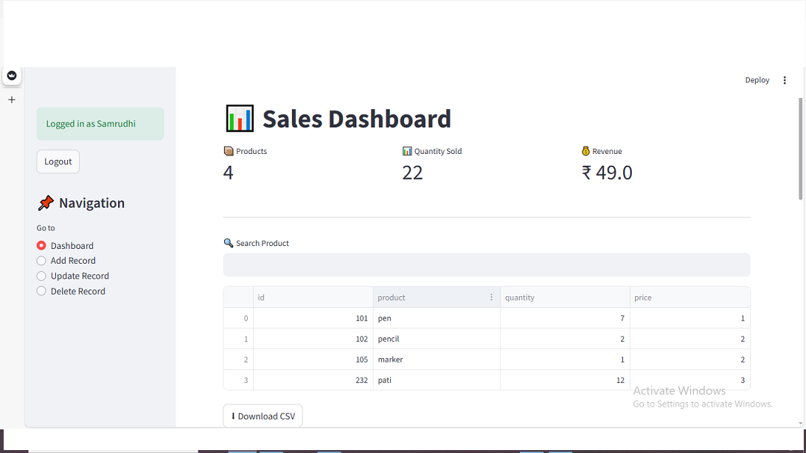
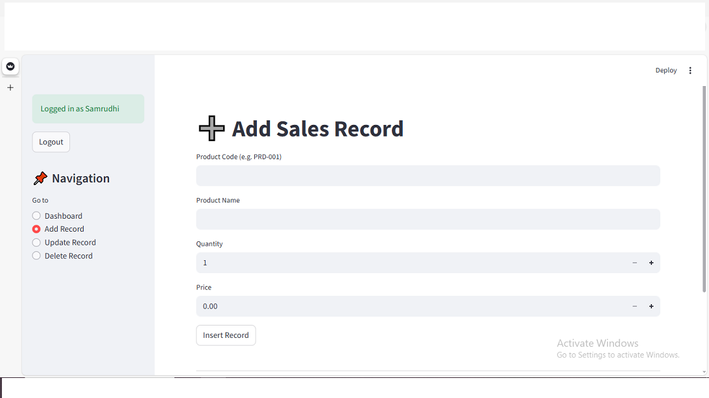
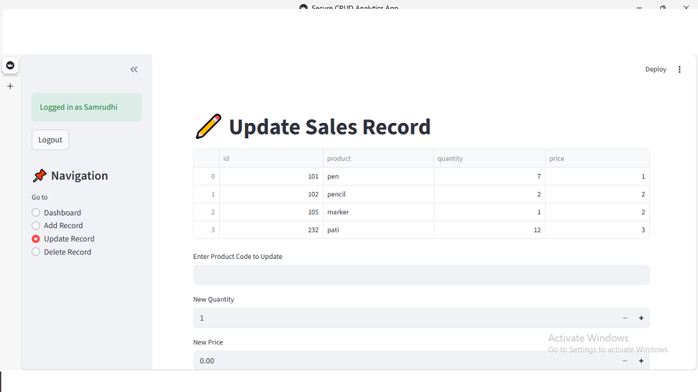
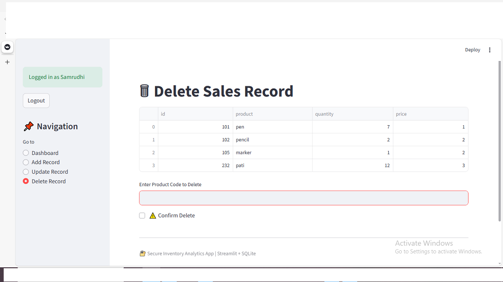
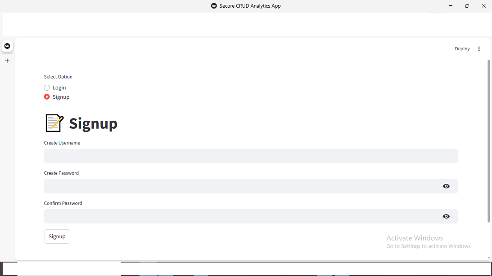

# CRUD_Analytics_App
A Data Analytics dashboard built using Python and Streamlit that allows users to perform CRUD operations and view real-time analytics. Data Analytics CRUD Dashboard using Python &amp; Streamlit

# 📊 CRUD Analytics App

A Data Analysis dashboard built using Python and Streamlit that performs CRUD operations and shows real-time analytics.

## 🚀 Features
- Insert, update, delete sales records
- Interactive dashboard with KPIs
- Product-wise sales analysis
- SQLite database integration

## 🖼️ Application Screenshots

### 📊 Dashboard


### 📈 Sales Analytics Chart


### ➕ Add Sales Record


### ✏️ Update Sales Record


### 🗑️ Delete Sales Record


### 🔐 Login / Signup



## 🛠️ Technologies Used
- Python
- Streamlit
- Pandas
- SQLite
- Matplotlib

## ▶️ How to Run
```bash
pip install streamlit pandas matplotlib
streamlit run app.py
